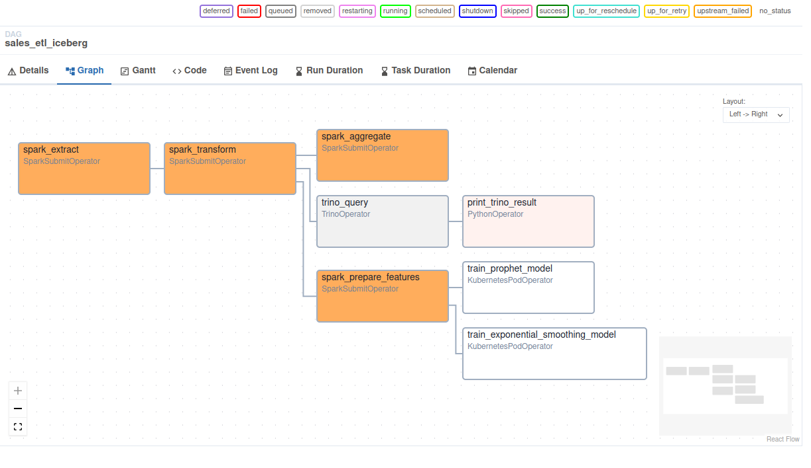

# Data Pipeline with Spark, Iceberg, Hive, Trino, Superset & Airflow

## 📋 Overview

This project implements a modern, scalable ETL pipeline using Apache Spark, Apache Iceberg, Hive Metastore, and Trino — all orchestrated with Apache Airflow and powered by object storage via MinIO. It enables structured data ingestion, transformation, and analysis with support for large-scale queries and dashboarding tools like Superset.

---

## 🔁 Pipeline Flow

### 1. **Extract CSV Data from MinIO**

- Raw sales data is stored as CSV files in a MinIO bucket.
- A Spark job reads these files (`extract.py`).
- Additional metadata is added (e.g., `ingestion_date`, `source_file`).
- Output is written as partitioned **Parquet** files to a *warehouse* bucket.

### 2. **Transform & Structure**

- Spark reads the previously generated Parquet files (`transform.py`).
- Schema is explicitly defined with typed columns (e.g., `INT`, `STRING`, `DATE`).
- Simple transformations and cleanups are applied (e.g., date parsing, formatting).
- The output is written to an **Apache Iceberg** table using the **HiveCatalog**.

### 3. **Catalog with Hive Metastore**

- Tables are registered in Hive Metastore, enabling query engines like Trino to discover them.
- The warehouse path is configured as an S3-compatible bucket in MinIO.

### 4. **Query & Analyze with Trino**

- Trino connects to Hive Metastore and reads Iceberg tables directly.
- Business logic and aggregation queries (e.g., sales per product per month) are executed.
- Results can be consumed by visualization tools like **Apache Superset**.

### 5. **Business Intelligence (BI) with Superset**

- Apache Superset is connected to Trino as a SQL source.
- It enables rich visual dashboards and data exploration over the Iceberg tables.
- Business users can analyze product performance, seasonal trends, and historical sales via an interactive UI.

---

## 🧰 Technologies Used

| Component        | Purpose                                      |
|------------------|----------------------------------------------|
| **Apache Spark** | ETL: Reading, transforming, and writing data |
| **MinIO**        | S3-compatible object storage for raw & parquet data |
| **Apache Iceberg** | Table format with support for versioning, partitioning |
| **Hive Metastore** | Catalog and schema registry for Iceberg    |
| **Trino**        | Distributed SQL engine for analytics         |
| **Apache Airflow** | Workflow orchestration of the entire pipeline |
| **Superset**     | BI and dashboard visualization               |

---

## 🚀 Use Cases

- Automated ETL pipelines on raw sales data
- Centralized, queryable warehouse with Trino
- BI dashboards for business teams in Superset
- ML-based forecasting on cleaned sales data

## 📊 Example Dashboard Insights

Superset dashboards can be created to visualize:

- Monthly sales trends per product line
- Top-performing product categories
- Forecasted vs. actual sales using ML models
- Data quality reports for pipeline monitoring

## 📝 Notes

- Trino and Superset connect directly to Iceberg via Hive Metastore — no traditional RDBMS is needed.
- Partitioning and Z-ordering are applied to Iceberg tables for query efficiency.
- Forecast results from ML models are also stored in Iceberg for unified analysis.

---

## 🧪 Example Query in Trino

```sql
SELECT
  PRODUCTLINE,
  MONTH(orderDate) AS order_month,
  SUM(sales) AS total_sales
FROM iceberg.db.sales
GROUP BY PRODUCTLINE, MONTH(orderDate);
```

## 🚀 Getting Started

All services needed to run the pipeline are provided in a single Docker Compose file.

- `make up`: Starts all services in the Docker Compose file.
- `make down`: Shuts down all services and removes all images in the Docker Compose file.
- `make logs`: Follows the logs of the running services.

### Ports

- **MinIO**:
  - **Endpoint**: 9020
  - **Web UI**: 9021
- **Trino**:
  - 8089
- **Superset**:
  - 8088
- **Airflow**:
  - 9093
- **Hive Metastore**:
  - 9083

## Screenshots

#### Simple ETL Pipeline in Airflow



#### Business Intelligence with Superset


## Credits

- Data: [Kaggle](https://www.kaggle.com/datasets/kyanyoga/sample-sales-data/data)
